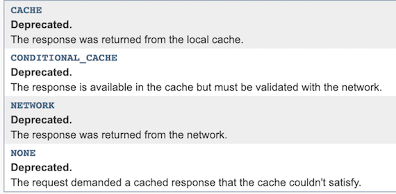

# OKHttp 1.0.0 디버깅
OkHttpUrlConnection의 getContentType() 메소드를 따라 OkHttp에서 어떻게 request와 response를 수행하는지 알아보자.

## 수정중입니다,, !

## OkHttpUrlConnectionImpl#getResponse()
### initHttpEngine()
  - HttpEngineFailure가 존재한다면 해당 Exception 발생
  - connected = true;
  - doOutput이 true인 경우, POST/PUT 메소드로 변환
  - *HttpEngine 생성*
  
### HttpEngine을 반환한다.
HttpEngine이 ResponseHeaders를 가지고 있을 경우, HttpEngine을 그대로 반환해주지만 
앞서 initHttpEngine()에서 HttpEngine을 새로 생성했기 때문에 반환할 일이 없다 !

### execute()
``` java
/**
 * Sends a request and optionally reads a response. Returns true if the
 * request was successfully executed, and false if the request can be
 * retried. Throws an exception if the request failed permanently.
 */
```
execute() 메소드에서는 httpEngine의 sendRequest(), readResponse() 메소드를 수행한다. 
이 때 httpEngine에게 responseSource 값이 존재한다면, sendRequest()을 생략한다. 

#### responseSource은 ? 


sendRequest()
- prepareRawRequestHeaders() : 
  requestHeaders의 기본 헤더 디폴트 값 설정, cookieHandler에 따라 쿠키 기본 설정
- initResponseSource() : 
  responseSource를 NETWORK로 초기화한 후, cache관련 헤더 정보에 따라 CACHE | CONDITIONAL_CACHE로 설정한다.
  설정된 값에 따라 응답 캐쉬값을 응답값으로 설정한다. 
- 요청 헤더에 only-if-cached 헤더가 존재할 경우 [only-if-cached 헤더 정책](http://www.w3.org/Protocols/rfc2616/rfc2616-sec14.html#sec14.9.4)에 따라 
  gateway-timeout 이슈를 발생시킨다. 


sendResponse()

### HttpEngine과 HttpURLConnectionImpl의 관계는 ?

HttpEngine의 policy라는 HttpURLConnectionImpl을 가진다.
해당 변수는 HttpEngine이 HttpURLConnectionImpl의 initHttpEngine() 메소드에 의해 생성될 때, 바로 그 HttpURLConnectionImpl을 복사하여 할당한다.


