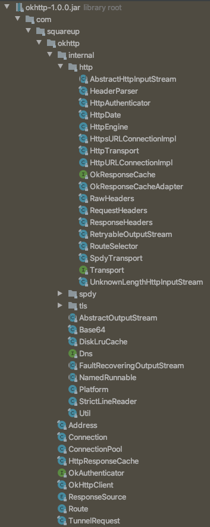

# ok-http 

### package 구조
초기 버전이라 그런지 패키지 구조가 단순하다. 
okhttp, internal, internal/http, internal/spdy, internal/tls 패키지로 구분해 놓았다. 


### 인터페이스 역할
1. Transport : 실제 전송을 담당하는 역할의 클래스. 
    - Returns an output stream where the request body can be written.
2. Dns : Domain 에 매핑되는 IP 주소를 질의할 수 있는 인터페이스 제공.
    - Domain name service.
3. OKResponseCache : 요청에 대한 응답 캐시를 담는 역할.
    - An extended response cache API.
4. OKAuthenticator : 원격/프록시 서버에 대한 인증에 대한 함수를 제공.
    - Responds to authentication challenges from the remote web or proxy server by returning credentials.

### 프로세스
1. 클라이언트 생성
2. open(URL) : URL 을 받아, 프로토콜에 맞는 HttpURLConnection 의 구현체를 반환. 커넥션풀도 여기서 세팅
3. getResponse() : 
    
    1. initHttpEngine() : http 엔진 초기화
    
    2. execute(), sendRequest() : 요청 보내기
        1. 요청헤더 준비
        2. ResponseSource : 캐시정책 체크
        3. sendSocketRequest() : Connection.connect() : 실제 소켓을 생성하여 맺음 (플랫폼마다 다른 maximum transmission unit of the network interface)
        4. 커넥션 풀 가져옴. 
        5. DNS 질의 하여 IP 주소를 get. InetAddress[] getAllByName(String host)
        6. request line 세팅
        7. Transport.class createRequestBody() : 실제 스트림 전송을 담당. 요청 쓰기(PUT/POST 인 경우, 요청 헤더를 쓰고 body가 쓰여질 OutputStream 을 반환)
    
    3.  readResponse() : InputStream 에서 response read 
        1. message body 가 없다면 여기서 request header 를 write 한다.
        2. response 를 파싱하여 객체에 담는다.
    4. retry
    
### initHttpEngine
new HttpEngine() 하면서 타임아웃에 대한 응답은 미리 만들어 놓는다.
```
      Map<String, List<String>> result = new HashMap<String, List<String>>();
      result.put(null, Collections.singletonList("HTTP/1.1 504 Gateway Timeout"));
```
